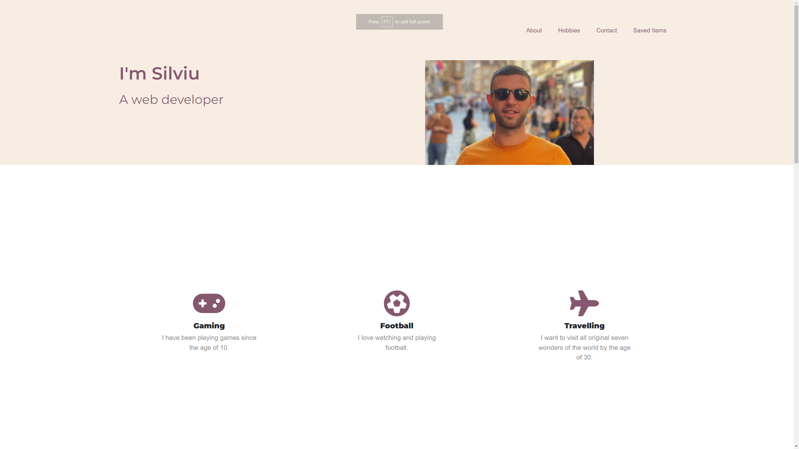
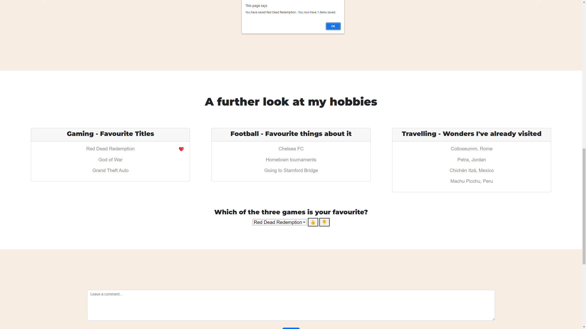
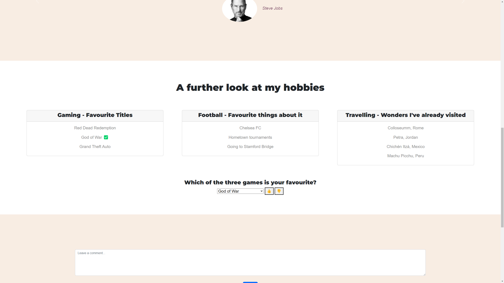
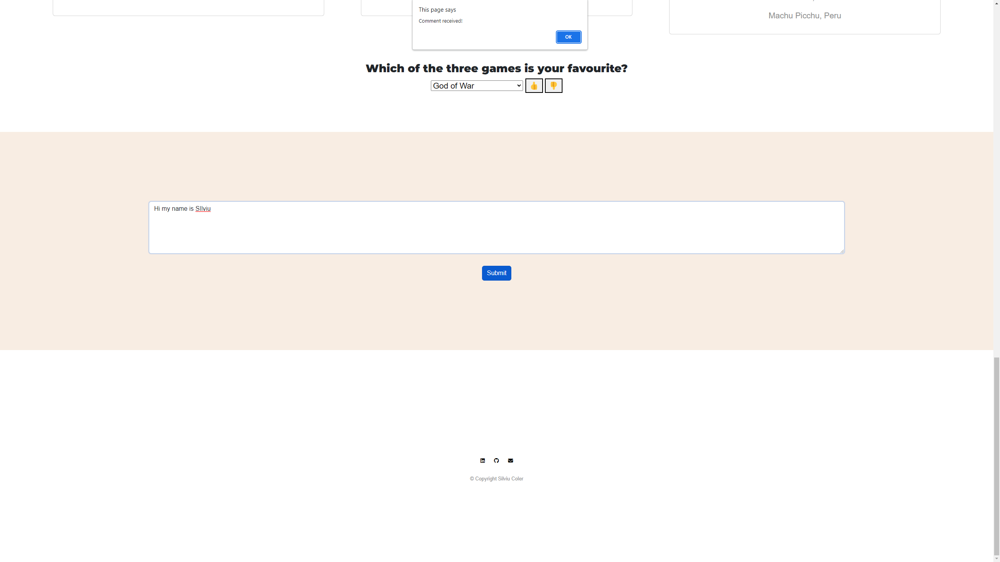
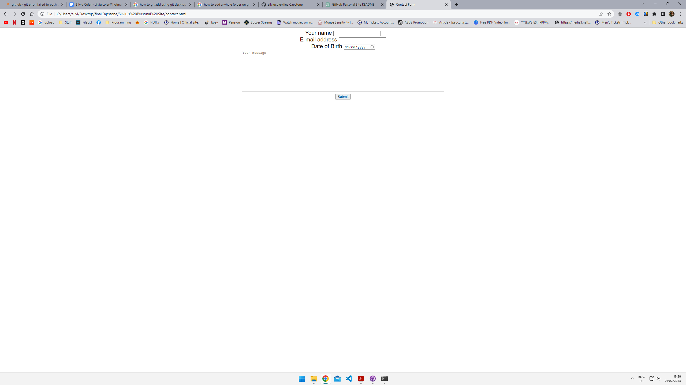

# My Personal Site

## Description

This is a personal website that showcases details about me and my hobbies. The website is designed to give a glimpse into my personality and interests.

## Table of Contents

1. Introduction
2. Installation
3. Usage
4. Credits

## Introduction

The personal site has been developed to provide information about me and my hobbies to anyone who visits the site. The site includes sections about my background, education, work experience, and interests.

## Installation

To run the personal site locally, follow these steps:

1. Clone the repository to your local machine using the command **git clone** https://github.com/silviucoler/finalCapstone.git
2. Navigate to the project directory using the command **cd finalCapstone**
3. Install the necessary dependencies using the command **npm install**
4. Start the local development server using the command **npm start**

## Usage

Once the local development server is running, access the website in your browser at http://localhost:3000. The site should display information about me and my hobbies, as well as navigation links to different sections of the site. Alternatively, open the index.html file which will display the website locally.

## Credits

This personal site was developed by me as a solo project. However, if you would like to contribute to the project or suggest any changes, feel free to create a pull request.
